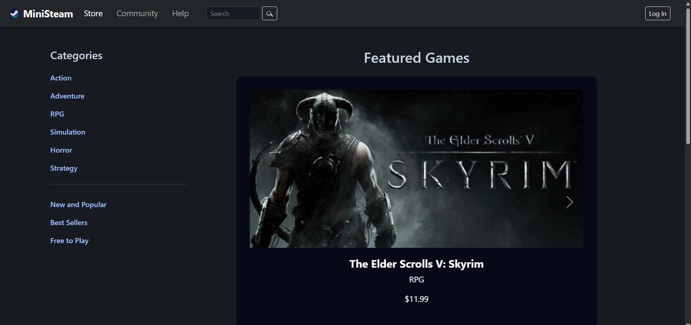
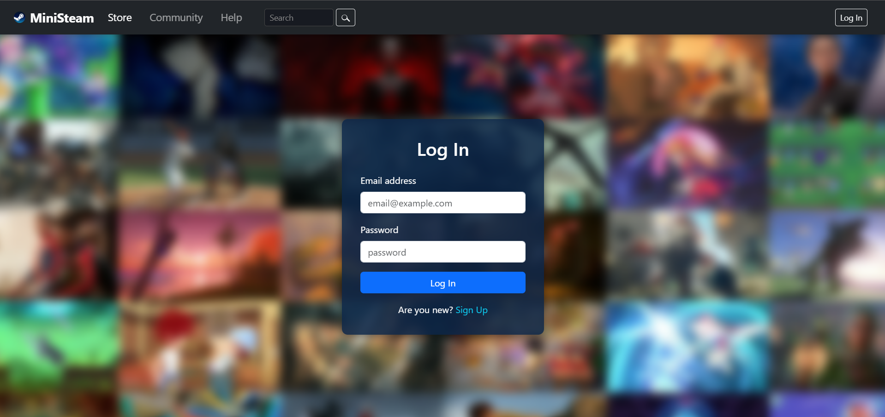

# MiniSteam

MiniSteam is a simple web application inspired by the Steam platform.  
It allows users to browse games, view details, and simulate a basic storefront experience.

## Features
- Browse a list of games
- View game details (title, genre, price, description)
- Search for games by genre

## How to Run
1. Clone this repository:
git clone https://github.com/ycnkc/ministeam.git
2. Navigate to the project folder:
3. Open `index.html` in your browser  
4. Browse the application

## Technologies
- HTML5 & CSS3
- JavaScript

## Notes
- This is a learning project for practicing web development and frontend skills.
- Data is static and for demonstration purposes only.

